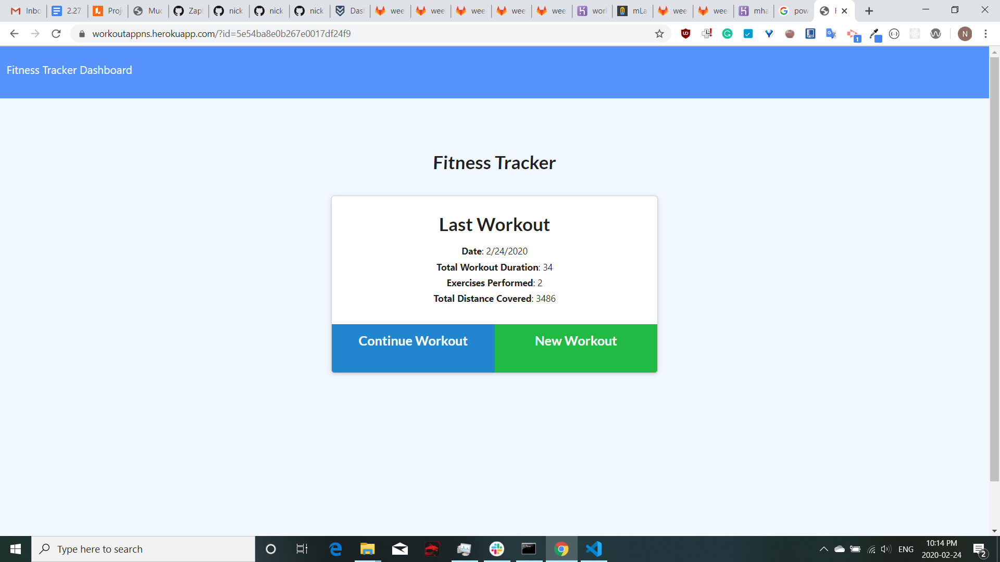

# WorkoutTracker
https://workoutappns.herokuapp.com/

## Description

This app allows users to persistantly track their workouts. When the user loads the page, they are given the option to create a new workout, or continue with their last workout. The user can add exercises to a previous workout plan, add new exercises to a new workout plan or view the combined weight of multiple exercises on the stats page. They are able to add multiple parameters to their weight or cardio based exercises. This app utilizes MongoDB.
